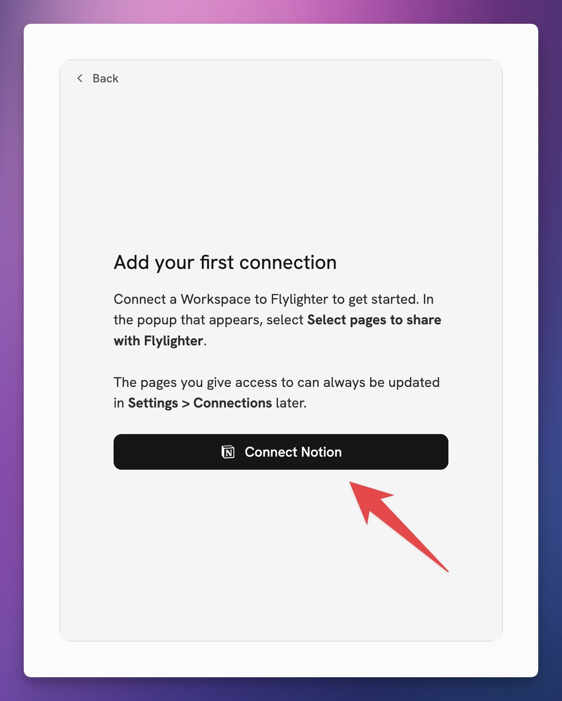
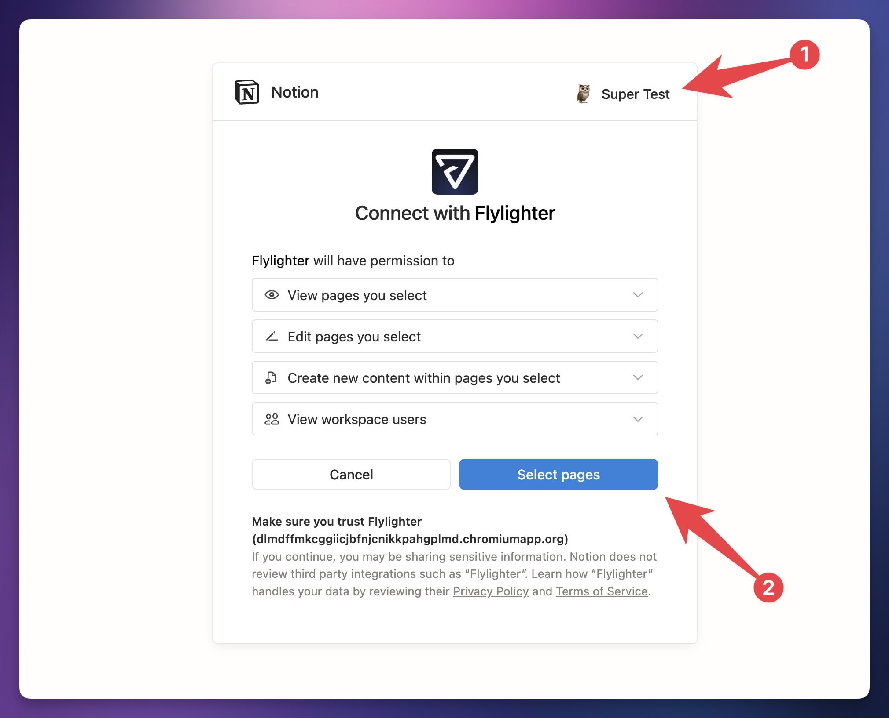
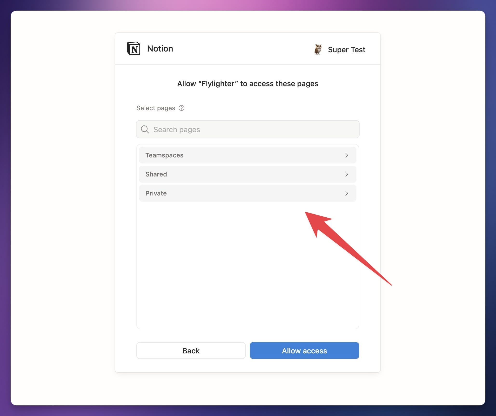
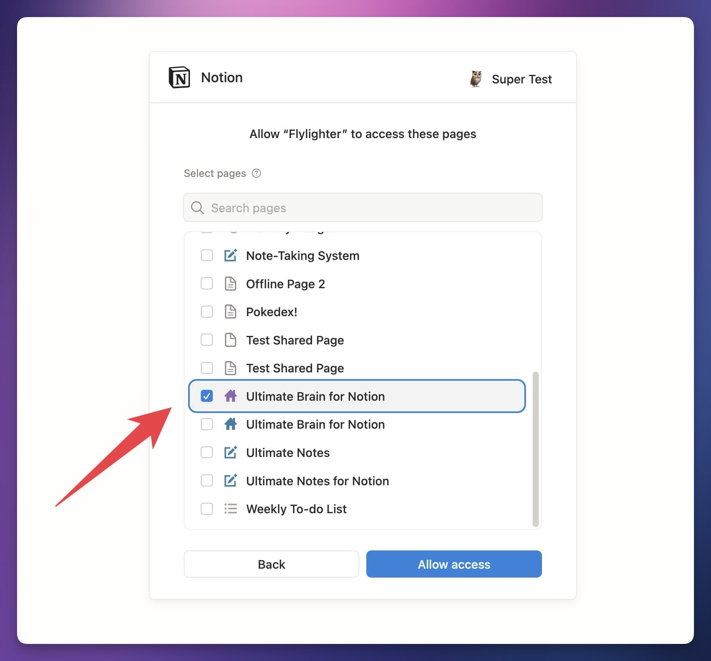

# Authenticating Notion

After you log into your Flylighter account for the first time, you'll be prompted to **add your first connection.**

This process will securely authenticate Flylighter with your Notion workspace via the Notion API. To get started, click **Connect Notion.**

<figure><figcaption></figcaption></figure>

This will launch the standard Notion API connection popup.


Since Flylighter uses the official Notion API, it can capture information _only_ to the specific Notion workspace that you select in this process. In that workspace, Flylighter can only capture to specific pages/databases (and their sub-pages) that you choose.


On the first screen, you should first check that you're authenticating with the Notion workspace that you want to use. _Keep in mind that your Notion account may be part of several workspaces, so the default workspace may not be the one you want to use!_

Once you've selected the right workspace, click **Select Pages.**

<figure><figcaption></figcaption></figure>

By default, this authentication popup shows you a list of collapsed workspace sections.

For Flylighter to be able to access any pages or databases in your workspace, **you must manually grant access to them here.**

You can either open the sections or use the search bar to find the pages or databases that you want.

<figure><figcaption></figcaption></figure>

Note that if you grant access to a **parent** page, Flylighter will get access to any pages or databases within it (its child pages).

For this reason, it's usually easiest to choose a high-level page that contains all of the databases to which you want to capture information.

Example: I'd like to capture articles and research to my [Notes database](https://thomasjfrank.com/docs/ultimate-brain/databases/notes/) in [Ultimate Brain](https://thomasjfrank.com/brain), so I've found my **Ultimate Brain** page. Since the Notes database is contained within the Ultimate Brain page, Flylighter will automatically get access to it and I'll be able to choose it later as my capture destination.

<figure><figcaption></figcaption></figure>

For now, just select the pages or databases you know you'll need for the moment. If you want to capture to another page or database, don't worry – you can always grant Flylighter access to more pages by either:

1. Going to **Settings → Connections** in Flylighter and hitting **Refresh Connection** to run this authentication process again so you can select more pages
2. In Notion itself, hitting the `•••` button in the top-right corner of any page, going to **Connections,** and adding Flylighter from there


PS: If you don't already have your own note-taking setup in Notion, you can use my free [Ultimate Notes](https://thomasfrank.notion.site/Ultimate-Notes-615417469d764e4c8136944371f21da1?pvs=4) template, which is similar to Ultimate Brain's notes dashboard.



**Note:** If you give Flylighter access to a lot of databases, it can take a while to index them when you're setting up your first Flow. We're working on improving the performance of this process, but you can speed it up yourself by hand-picking only a few databases or pages.


Once you've connected your Notion account, you can [create your first Flow](create-your-first-flow.md).

Flows are what you'll use to quickly capture web pages, articles, highlights, and more to Notion.
