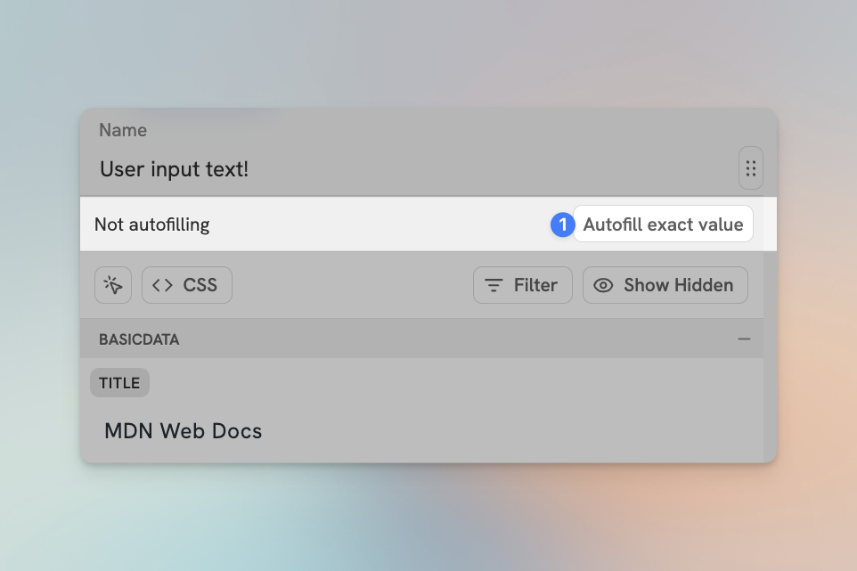

# Auto-Filling Flows


This page is incomplete, out of date, or otherwise under construction.


Most properties in a Flow can be **auto filled** with data, which makes captures even faster. Some properties – like Title, URL, Page Icon, and Page Cover – automatically set themselves to auto-fill when you choose an option from the Data Picker.

You'll almost always want to auto-fill dynamic data from the page for these properties, so we made these properties automatically auto-fill just to make setting up new Flows faster. But you can always open the Data Picker back up and set auto-fill to **Nothing** if you don't want something to auto-fill.

A few Notion property types automatically set themselves to auto-fill with dynamic data in Flylighter:

* Name (the title property in a database)
* URL
* Page Icon
* Page Cover

For any other property type (e.g. Select, Number, Relation, etc.), you can set the auto-fill&#x20;

## Data Items & Input Items

To understand how Flows save data for auto-filling, we'll make a distinction between two types of data:

* **Dynamic Data** are items chosen from the **Data Picker**, like page titles, urls, etc. These are relative to the page you are on.
* **User Input** are items that are either manually input, or derived from your existing properties like selects, statuses, etc.

## Auto Filling

By default, Flylighter will save **Dynamic Data** as the default fill when you select it. When a data Item is saved, you can edit it freely without effecting the auto fill. For example removing an unwanted part of a page title.

**User Input** must be manually saved for auto fill if you want it to remain the same across captures. For example, to save a select option to auto fill, first select the value, then open the Data Item globe, and hit the **Auto fill exact value** button.

<figure><figcaption>

</figcaption></figure>

The automatic saving of auto-fill values for **Data Items** can be changed in the [Flows](../flows/index.md) tab  in Settings.

## Auto Fill Indicators
In the Data Picker of each property, the top bar will have the following indicators:
1. A brief message about the auto fill state.
2. Options relative to the current auto fill state.
3. A color background to help understand the state at a glance.
   
<figure><figcaption>
The save button on an Input Item
</figcaption></figure> 
When a property is set to auto fill, the **`⋮⋮`** buttons outline serves as an indicator of the auto fill state.

* **Blue** indicates that the property is set to auto fill.
* **Orange** indicates that the property is set to auto fill, but the value differs from the auto filled value. This could be because you have modified the auto filled value, or the dynamic data has changed (for example, navigating to a different page when Flylighter is in sidebar mode).
* **Gray** indicates that the property is not set to auto fill.

<figure><figcaption>
The auto fill indicator
</figcaption></figure>

