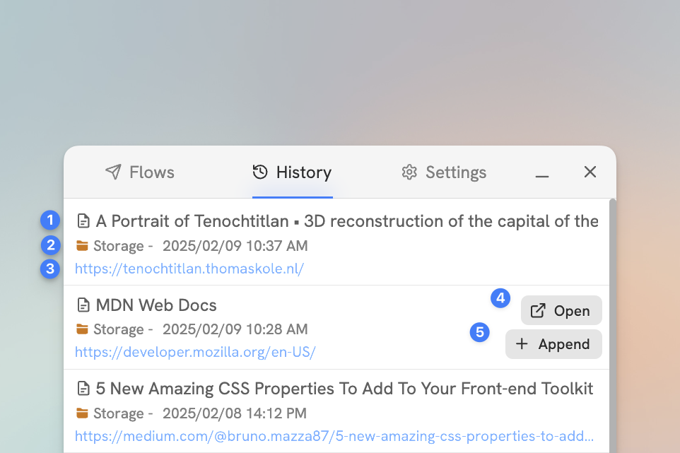

# Capture History


Capture History is limited to viewing the 10 most recent captures, and appending to the 3 most recent on the free plan.


Capture History can be accessed by clicking the **History** tab. This will list all the captures you have made, and give you access to a number of options.
1. The page icon and title as they were when the capture was made.
2. The destination it was captured to, as well as the date and time it was captured.
3. The URL of the page you were on when the capture was made.
4. A button to open the capture.
5. A button to append to the captured page. See [Capture Modes](../in-depth/capture-modes.md#append-capture) for more information.

<figure><figcaption>

</figcaption></figure>

