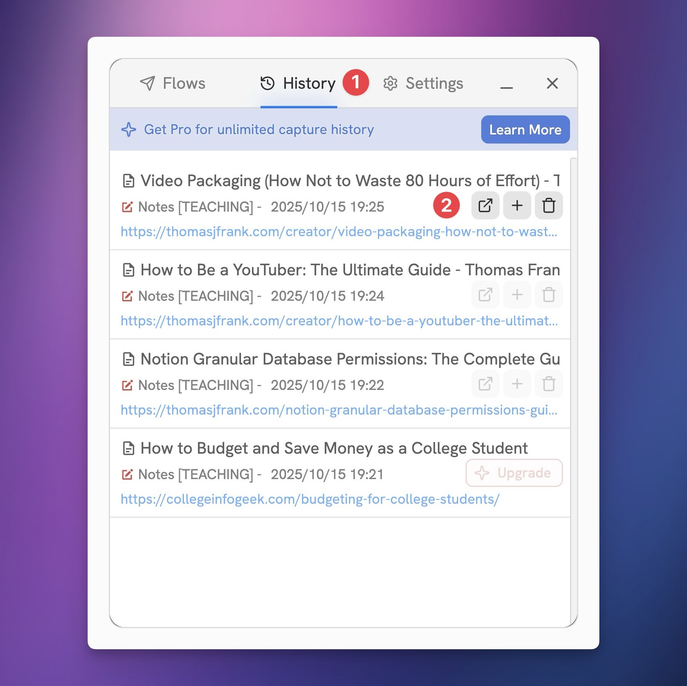

# Capture History

Flylighter saves a history of your previous captures, allowing you to re-access their web pages, open the capture Notion pages, and even **append** new page content to previously-captured pages.

On the free plan, Capture History has a couple of limits:

* The 10 most recent captures will be visible
* The 3 most recent captures will have Append and Open in Notion available

You can [upgrade to Flylighter Pro](https://flylighter.com/pricing/) to get **unlimited capture history,** removing both of these limits. In addition Flylighter Pro will _sync_ your capture history across all your devices and browsers.

Capture History can be accessed by clicking the **History** tab. This will list all the captures you have made. For each capture, you can:

1. Access the original web page URL
2. Open the captured pages in Notion
3. Append new blocks to the page content of the existing Notion page created in a previous capture
4. Delete the capture history item

<figure><figcaption></figcaption></figure>

### Capture History FAQs

What Capture History data is synced in Flylighter Pro accounts?

When you [upgrade to Flylighter Pro](https://flylighter.com/pricing/), your capture history is synced between all your devices and browsers.

Currently, the data that is synced includes:

* Webpage title
* Webpage URL
* Webpage icon
* Notion URL (the URL of the captured page in Notion)

Additionally, Flylighter Pro syncs all of your Flows, their configuration, and all of your app settings.

Capture History sync does not include additional webpage data, nor data manually added to the Content Editor or to database property fields. All of this data is already in Notion; since Flylighter is 100% focused on being a capture tool, we don't have plans to sync this data.

Can I change database property values in Append mode?

We don't support changing property values on existing Notion pages when you're using Append mode.

This is a conscious decision that has to do with **data integrity.** Creating a new page is a safe operation, from a data-integrity standpoint. That page doesn't yet exist, so it's purely a `CREATE` operation, to use datbase-speak. There's no existing data that can be negatively affected.

Appending _blocks_ to an existing page is, similarly, a `CREATE` operation. When you append blocks with the Notion API, you're simply add new _child blocks_ to the existing page block. This does technically modify the page block's list of child blocks, but only in an additive way.

Updating database property values is entirely different. In the Notion app, you can update a database property in an additive way – for example, you can add another option to a page's Multi-Select property.

However, when integrations like Flylighter update property values via the Notion API, the operation is always a _completely overwrite_ of the property's current value.

In the case of a Multi-Select property, an integration must first read the current list of values in the property, then make a request that includes all of them _plus_ the new value you want to add. It can't just tell Notion to add a new value to what's already there.

This gets us into dicey territory. Flylighter could read a property's current data, but then another user could update that property before Flylighter made a capture. This could cause Flylighter to overwrite that user's update.

Additionally, Relation properties may not show an integration all of their values. Since property value updates via the API require complete overwrites of the current values, this could cause an integration like Flylighter to actually remove a value from a Relation.

In summary, there are simply too many data integrity challenges for appending database property values to be feasible right now.

