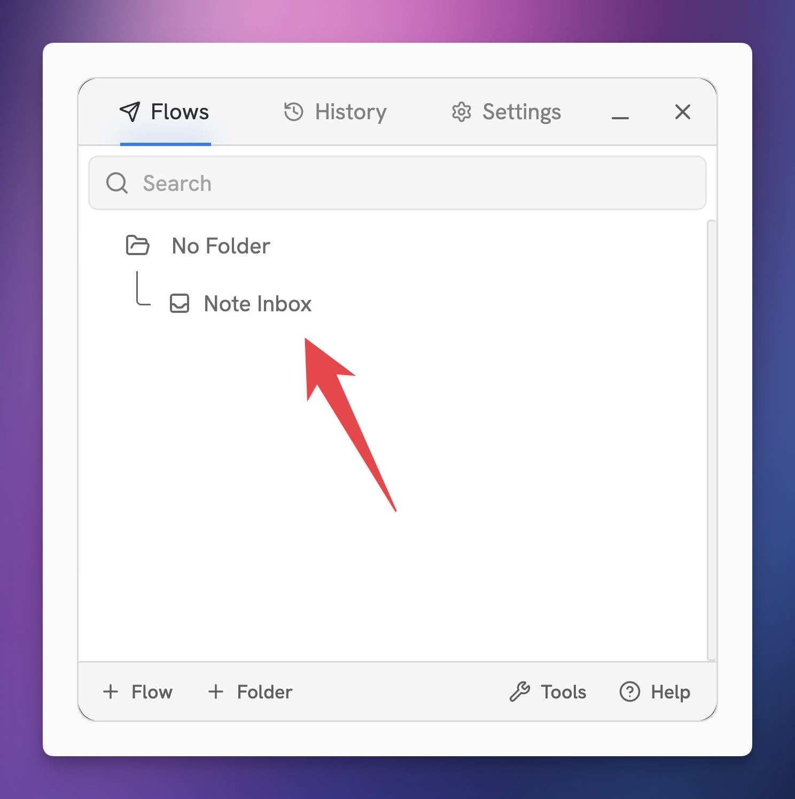

# Create Your First Flow

Say you stumble upon a really cool web page about [accelarated learning](https://fs.blog/learning/), and you'd like to save it to Notion so you don't lose it.

This is a job for a Flow!

**Flows** are preset workflows for capturing information, including:

* **Web data** – URLs, page titles, full articles, metadata
* **Notion property values** – icons, page covers, tags, Relations, dates, and more
* **Page content** – nearly any web data can be capture to a Notion page (full articles, highlights, screenshots, and more)

With Flows, you can ensure whatever you're capturing goes to the _right place, right away._

For capturing our article on accelarated learning, perhaps we set up a Flow that:

* Captures to your **Notes database** in Notion
* Grabs the article's title, URL, and cover image
* Applies your **Learning** tag page, so you see the article in the filtered notes view on that page in your note-taking system.

In fact, let's do just that!


**Tip:** If you don't already have a note-taking system, you can use my free [Ultimate Notes](https://thomasfrank.notion.site/Ultimate-Notes-615417469d764e4c8136944371f21da1?pvs=4) template, which ready for this tutorial right out of the box.

_If you're already using_ [_Ultimate Brain_](https://thomasjfrank.com/brain/)_, you've already got the most advanced version this same note-taking system (along with extra features)._


## Create Your First Flow

Click **+ Flow** to create your first Flow. You can also hit **+ Folder** if you'd like to create a folder for it first.

<figure><figcaption></figcaption></figure>

The first time you do this, Flylighter will ask you to set up your **default autofill options.** These will determine what data will be set to autofill by default on _all_ new Flows you create.


**Note:** You can customize each of these settings per-flow, and you can also change the defaults later in Settings. These defaults just help you create new flows more quickly.


By default, Flylighter will attempt to autofill the Title property, a URL property (if your database has one), the page icon, and the page cover.

We don't automatically capture entire articles by default, but you can enable this here.

<figure><figcaption></figcaption></figure>

Next, you'll actually create your first Flow. In the Flow-creation dialogue, you can set the following:

* Flow name
* Icon
* Flow type (for now, leave this as Database. View [Capture Modes](../in-depth/capture-modes.md) for more info)
* Folder (if you create folders on the main screen, you can organize your Flows in them)

Once you're happy with your settings, click **Create Flow.**

<figure><figcaption></figcaption></figure>

Your first Flow is now created and ready to be connected to a Notion database!

If you like, you can hit the `+ Folder` button at the bottom of the app to create a folder, then you can drag your new Flow into it.

Otherwise, click the flow to start configuring it.

<figure><figcaption></figcaption></figure>

### Choose a Database

Next, choose a Notion database. This will be your **capture destination** – when you run a Flow, it'll create a new page in this database with all your captured information.

<figure><figcaption></figcaption></figure>


Remember that Flylighter needs access to a Notion database before you'll see it in the list of choices. If the database you want doesn't show up, you can manually give Flylighter permission to access it by going to the database in Notion, hitting the ••• menu in the top-right corner, and then clicking **Flylighter** in the **Add Connections** sub-menu.


Once you've chosen your database, all of the database's visible properties will show up in the Flow editor. Let's do a brief overview of the Flow Editor:

<figure><figcaption></figcaption></figure>

1. **Page icon -** This is the page icon to be captured. By default, it is automatically filled with the site's icon/favicon. You can click it to open the data picker and choose a different icon.
2. **Page cover image** - The page cover. By default, it's filled with the web page's social sharing image.
3. **Notion database** - This is the Notion database you chose in the last step. New pages will be created here when you run the flow.
4. **Database properties -** Each item shows the property name, its type, and the value to be captured.
5. **Data picker button** - Opens either the property's options or a selection of capture tools and metadata from the page. Well go over this more in-depth soon.
6. **Capture button** - This will capture the current page to the database.

### Add Web Data

When you're capturing to a database, you can set three types of values in Notion database properties:

* **Web data** – e.g. actual data from the web page you're visiting, like the title, URL, etc.
* **Existing/new property options** – e.g. options in a Select, Multi-Select, or Relation property. You can choose existing values or create new ones (in the latter case, some properties require your database to be unlocked).
* **Text, numbers, checkbox states, dates** – in certain property types, you can simply type or set your own custom values manually.

Let's start by adding some **web data** to your first capture. Typically, you'll want to use web data – usually the web page's **title** – when capturing that page.

By default, Flylighter will autofill the icon, cover image, title, and url.

On each property, you can click the **`⋮⋮`** **grab handle icon** to open up the **Data Picker.**

<figure><figcaption></figcaption></figure>

The Data Picker is a powerful tool that lets you fill the selected property with web data from the current page. _(Technically, it's a suite of **plugins** – but we'll dig into those later!)_

Try clicking on the globe icon for the _Name_ property – this is pulled from your Notion database, so if you renamed it to something else (e.g. "Title"), it'll be labeled accordingly.

By default, this should already be autofilled with the title of the current webpage. However, you can select any of the other values in the list if you like – or you can simply type in the field!

By the way, Flylighter will surface **special details** on specific sites, like LinkedIn, YouTube, and X/Twitter. On these sites, you'll see a site-specific tab in the Data Picker. On LinkedIn, for example, you can capture a person's name, headline, location, and other details – perfect for CRM workflows.

<figure><figcaption></figcaption></figure>

Flylighter is all about **speed,** and we've designed it with a unique system that can help you easily **autofill** properties when you're running a Flow.

Notice how the Name property is being autofilled with the Title **data type.** This means the autofill is dynamic; when you run the flow, whatever value of the current page is found for Title will be captured to this property.

<figure><figcaption></figcaption></figure>

This is _really powerful._ We'll cover this more later, but this unique design allows you to:

* Instantly capture pages with auto-filled data most of the time
* Easily go into the Flow and quickly change a property's value either **one-time** or **permanently** – without needing to go to a separate Settings page.&#x20;


**Tip:** Head to the [Auto-Filling Flows](auto-filling-flows.md) page to learn more about how you can set rule for auto-filling properties with web data! **Title** and **URL** properties set themselves to auto-fill by default.


### Set Existing Property Options

Some Notion properties will also have a small 🔽 icon, which will let you select one or more existing options from a list. These property types include:

1. Select
2. Multi-Select
3. Status
4. Relation

You can also create new options in these properties right from Flylighter! Just start typing to bring up that option in supported properties.


**Note:** For some property types, like Select and Multi-Select, your database needs to be unlocked before you'll be able to create _new_ options. [Learn how to unlock a Notion database here](https://support.thomasjfrank.com/customizing-your-templates/78ZReSibJg7dV9R7ouqQrS/how-to-unlock-notion-databases/muCk11PNirQRjH5xaQRs9V).


Here, I'm selecting the _Essays_ and _Productivity_ pages from my Notes database's **Tag** relation, which is connected to a separate Tags database.

<figure><figcaption></figcaption></figure>

Currently, you can see that this property is **Not Autofilling.** This means that these two pages will only be set in this Tag property on this run of the Flow. It's as if I'm filling out a form and choosing these values specifically for this submission.

But what if I want this Flow to _always_ set these two pages in the Tag property? If that's the case all I need to do is click **Autofill Exact Value!** This will save the current setting as the property's autofill value.

In this way, Flylighter lets you change the configuration of your Flow _while you're using it._ No need to go into a separate Settings page.

### Set the Page Cover and Icon

You can also set the Cover Image and Icon in the Notion page that will be created from your Flow.

<figure><figcaption></figcaption></figure>

Next to the Flow's database, you'll see the Icon and Cover options with previews. These work similarly to the Notion properties below them; click them to open the Data Picker, and you'll see several options:

* **Icon:** In the Web Data plugin, you can choose the site's favicon. You can also use the arrows to navigate over to the Feather Icon and Emoji sections if you prefer those instead.
* **Cover:** If the page contains a featured image, cover image, or social media image, you'll see it here.

Icon and Cover values automatically set themselves to auto-fill with **Data Type.** This means you'll be able to automatically capture each web page's favicon and featured/social media image, if they exist.

### Add Page Content

If you'd like to capture content to the actual **page body** of the Notion page that will be created by your Flow, head to the **Content** tab.

Here, you'll find a block editor that will allow you to capture near anything as Notion blocks, including:

* Full articles
* Text highlights
* Images on the page
* Screenshots
* Manually-typed notes (fun fact: On YouTube videos, these get clickable timestamps!)

There's a _lot_ you can do in the Content Editor, so for now I'll just point your attention to the bottom section. This is the same set of plugins you see in the Data Picker within each database property in the Properties tab!


This the essence of Flylighter. We provide you a modular set of **plugins** for capturing data from the web, then we make them available everywhere – in the Content Editor, in database properties, and even in the page icon/cover settings.


<figure><figcaption></figcaption></figure>

In the screenshot above, you can see that I've clicked the Article data item from the Data Picker, so now it's a **block** in the Content Editor.


**Article** is a special data item that parses the entire article on the page using our custom web parser. Once you hit Capture, our parser will turn the entire article into Notion blocks.


If I want, I can add any number of additional blocks beneath it!

Additionally – just as I can do with property values – I can set this block to **autofill** on future captures. If I want this Flow to _always_ capture the full article, all I need to do is:

1. Click `⋮⋮` on the Article block in the Content Editor
2. Check **Autofill Data Type**

<figure><figcaption></figcaption></figure>

## Capture the Page

Once you've set your properties the way you want them, you can hit **Capture** to run your Flow and capture the current page to Notion.

<figure><figcaption></figcaption></figure>

Hit **Open in Notion** if you'd like to see your shiny, newly-captured page. Otherwise, the dialogue will automatically close after a few seconds.

At this point, your Flow is also set up and can be re-used at any time. Any value you've set to **autofill** will do so on each new capture – and you'll still be able to set additional values that may be unique on a per-capture basis.

## Build Additional Flows

Keep in mind that you can do a _lot_ more with Flows. Here are a few more example Flows you could build:

* **Instant Inbox Flow** – use Flylighter's Instant Capture feature and a keyboard shortcut to instantly capture a page to your notes inbox in Notion, without any tags. You can even set this to capture _full article text._
* **Research Flow** – open a Flow that allows you to select your tag on-the-fly, then open the Content Editor where you can capture highlights and add annotations to them.
* **Recipe Flow** – use Flylighter's Element Selector or Advanced Data plugins to select the recipe element at the bottom of your favorite cooking blog, and skip the 50,000-word story about how grandma used to make this recipe for me back when we lived in Ottumwa, Iowa. Back then, my grandfather worked at the cement plant, and he'd come back from a long day at the plant hungrier than a 2-ton bull hippopotamus. I think it was the summer of 1962 when she managed to grow a particularly big tomato crop, and so we spent a whole day in the garden harvesting....
