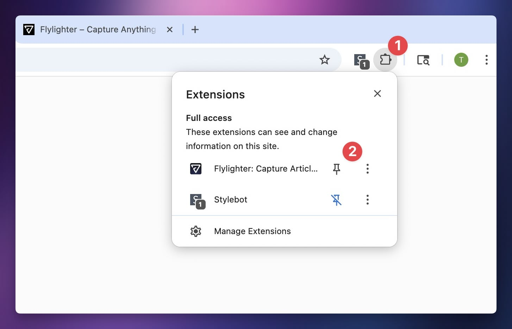
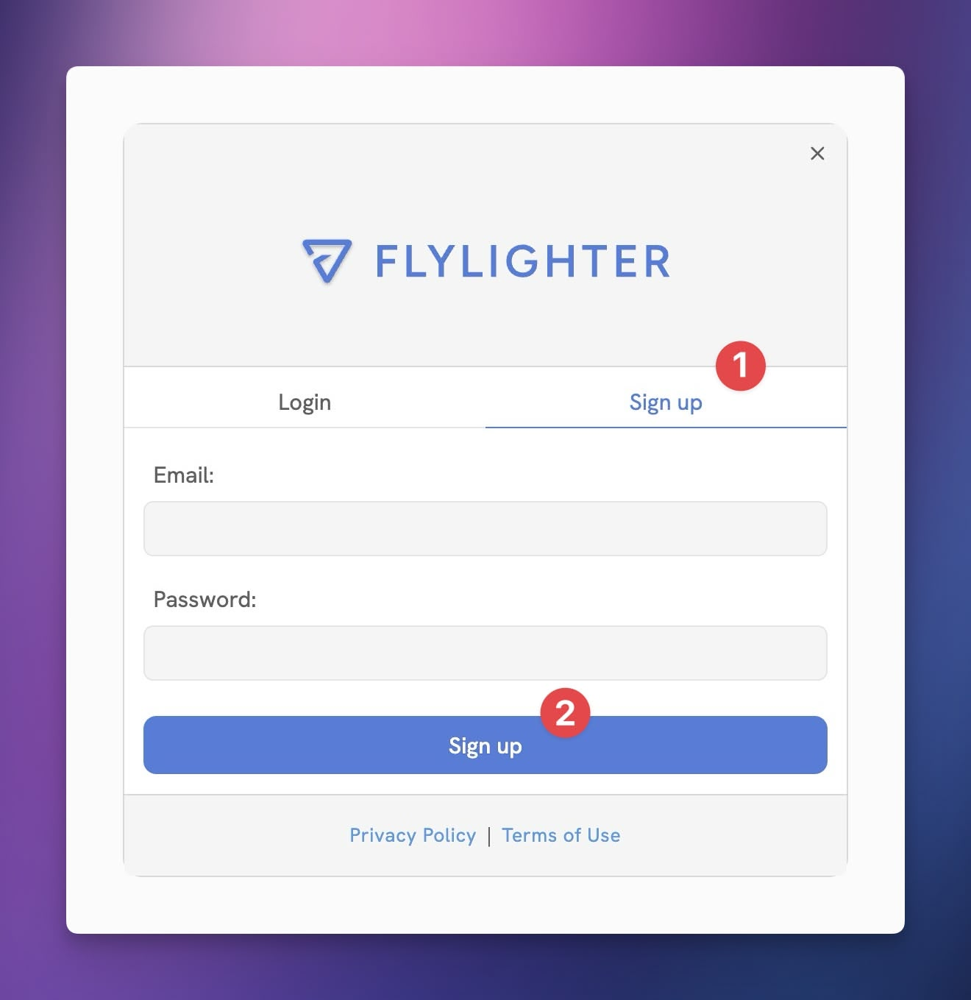

# Install Flylighter

Flylighter is a browser extension available on the [Chrome Web Store](https://chromewebstore.google.com/u/6/detail/flylighter/dlmdffmkcggiicjbfnjcnikkpahgplmd) and the [Firefox Add-Ons](https://addons.mozilla.org/en-US/firefox/addon/flylighter-beta/) directory.

It lives up in your web browser's toolbar, where you can click it to easily run any of your Flows and capture any information on the page you're visiting.

Flylighter is compatible with any Chromium or Firefox-based web browser, including:

* Google Chrome
* Firefox
* Microsoft Edge (Thomas's pick)
* Zen (Eli's pick)
* Arc
* Brave
* Opera


**Note:** Firefox extensions don't have as many capabilities as Chrome extensions do, so certain features available in Chrome-based browsers won't be available on Firefox or Zen.


## Install the Extension

You can find and install Flylighter directly from the Chrome Web Store, or via the Firefox Add-Ons direcotry (beta):

<table data-card-size="large" data-column-title-hidden data-view="cards"><thead><tr><th></th><th data-hidden data-card-cover data-type="files"></th></tr></thead><tbody><tr><td>                      <a href="https://chromewebstore.google.com/u/6/detail/flylighter-capture-articl/dlmdffmkcggiicjbfnjcnikkpahgplmd"><mark style="color:blue;">Download for Chrome</mark></a></td><td><a href="../.gitbook/assets/db1f6004383e1300e3046b592899c1b2.png">db1f6004383e1300e3046b592899c1b2.png</a></td></tr><tr><td>                      <a href="https://addons.mozilla.org/en-US/firefox/addon/flylighter-beta/">Download for Firefox</a></td><td><a href="../.gitbook/assets/9384fe92aef7ea0128be2c916ed07cea.png">9384fe92aef7ea0128be2c916ed07cea.png</a></td></tr></tbody></table>


Flylighter will not open on the Chrome Web Store, nor on Chrome settings pages. Extensions are not allowed to open on these special pages.


Once you've installed Flylighter, you may want to also **pin** it in your browser's toolbar by clicking the puzzle piece icon, then clicking the icon next to the Flylighter entry:

<figure><figcaption></figcaption></figure>

When you first open Flylighter, you'll be prompted to log in or sign up.

If this is your first time using Flylighter, click **Sign Up** to create a free Flylighter account.

_If you're using our Free plan, your Flylighter account is only used to make the process of downloading and restoring your user data more secure. If you choose to later upgrade to our_ [_Pro plan_](https://flylighter.com/pricing/)_, it'll also be used to sync your flows and capture history across your devices._

<figure><figcaption></figcaption></figure>

Once you've signed in, it's time to [authenticate Flylighter with your Notion workspace](authenticating-notion.md) so you can start capturing data to Notion!
