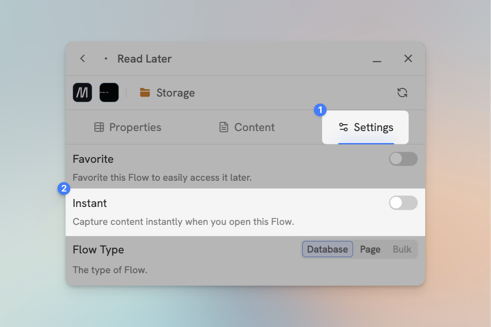
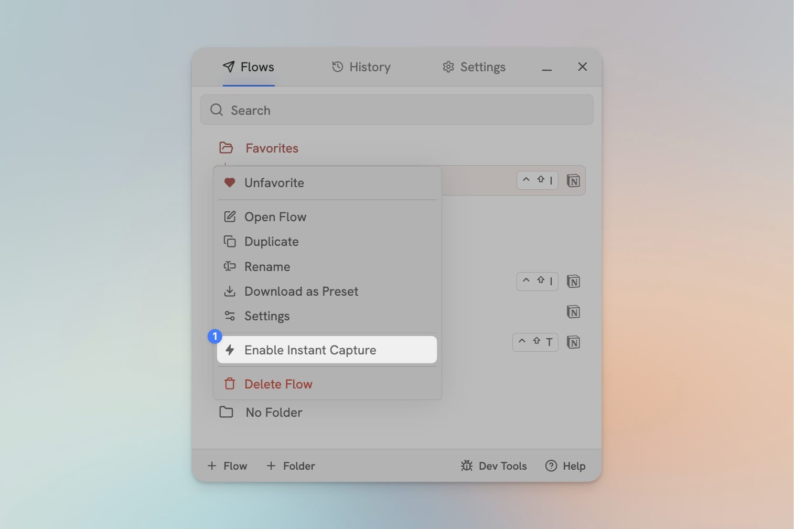
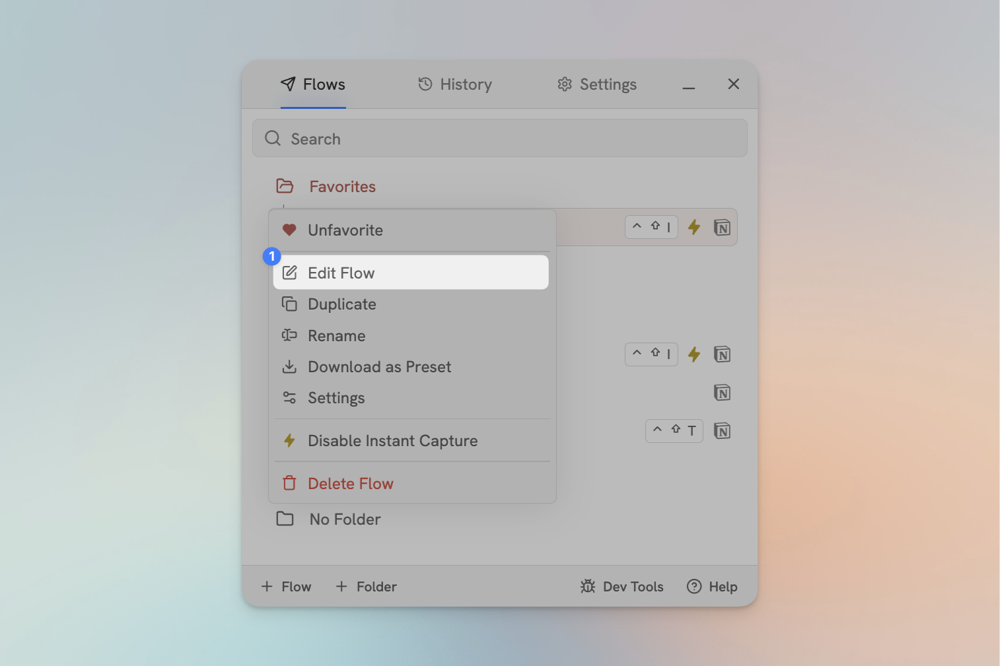

# Set Up Instant Capture

The Instant Capture setting allows you to execute Flows in two clicks...

1. Open Flylighter
2. Click the Flow

...or in one keyboard shortcut. 

*Visit [Keyboard Shortcuts](../settings/shortcuts.md) for more info on setting keyboard shortcuts.*

## Enabling Instant Capture
You can enable Instant Capture on any Flow by going to the **Settings** tab in the Flow Editor, and toggling the **Instant Capture** switch.

<figure><figcaption></figcaption></figure>

Alternatively, you can right-click any Flow in the main Flow list and click **Enable Instant Capture.**

Flow that have Instant Capture enabled will have a small ⚡️ icon to the right of their name.

<figure><figcaption></figcaption></figure>

When Instant Capture is enabled, you can open the Flow and edit it normally by selecting **Edit Flow** from the context menu.

<figure><figcaption></figcaption></figure>

## Set a Keyboard Shortcut

Two clicks still too slow for you?

In the Settings under the [Keyboard Shortcuts](../settings/shortcuts.md) tab, you can set a keyboard shortcut for any Flow.

Combined with Instant Capture, this will let you instantly capture any web page to your Flow using your keyboard shortcut!
