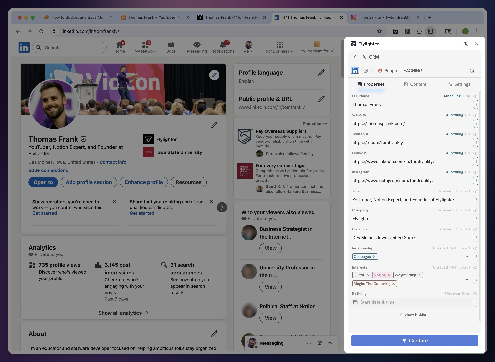
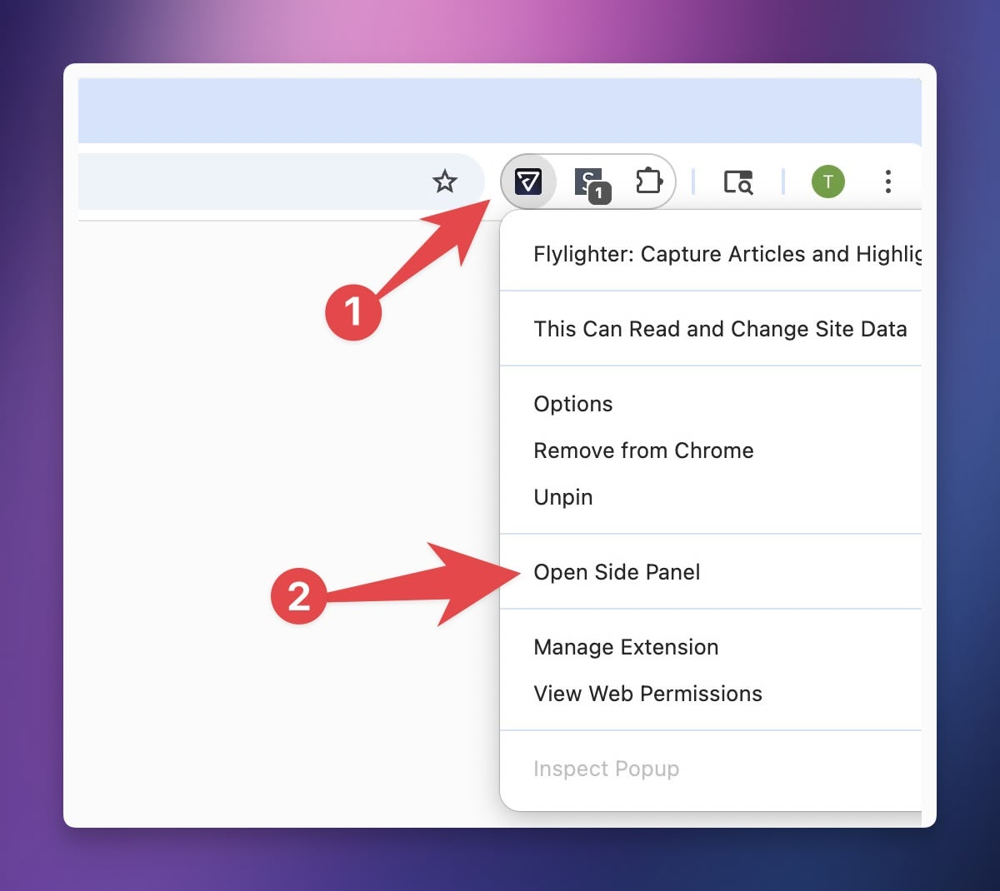

# Sidebar Mode

In supported browsers, Flylighter can be opened in **Sidebar mode.**

This is arguably the _best_ way to use Flylighter. Not only does this keep the Flylighter app from covering up visible elements on the page, but it also unlocks some **superpowers:**

* In a tab, you can navigate to new pages without closing Flylighter
* You can also switch _between_ tabs, capturing information from multiple tabs

Imagine you're adding a new person you've met to your Notion CRM. You've got their LinkedIn profile open in one tab, their Twitter account in another, and their portfolio site in a third.

With Flylighter open in Sidebar mode, you can capture information from _all three tabs_ in one go.

<figure><figcaption></figcaption></figure>

### How to Enable Sidebar Mode

Sidebar Mode works in browsers that have extension sidebar support.

**Supported Browsers (may not be an exhaustive list!):**

* Google Chrome
* Microsoft Edge
* Firefox (_only_ supports Sidebar Mode)
* Zen (_only_ supports Sidebar Mode)
* Brave
* Vivaldi

**Unsupported Browsers (may not be an exhaustive list):**

* Arc
* Dia
* Opera

In most browsers, you can enter Sidebar Mode by right-clicking the Flylighter extension icon and selecting **Open Side Panel.**

<figure><figcaption></figcaption></figure>


Other browsers may have a different process. In Firefox/Zen, Flylighter will always open in Sidebar Mode due to the Firefox engine's extension restrictions. In Vivaldi, there's a separate Flylighter icon in the side toolbar you can click.

