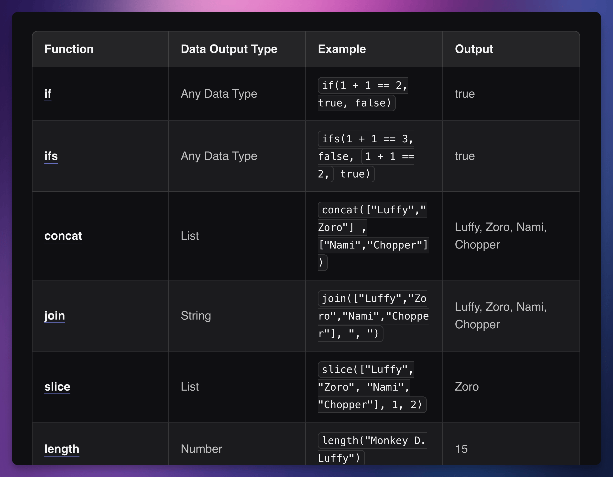
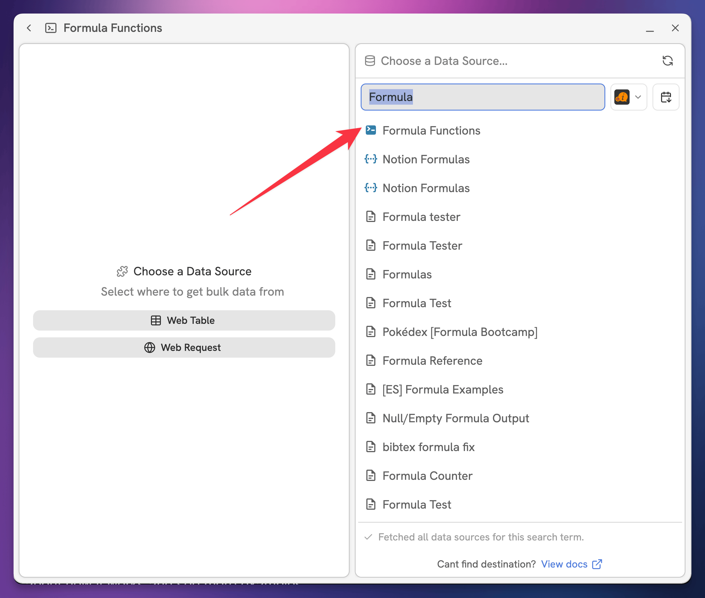
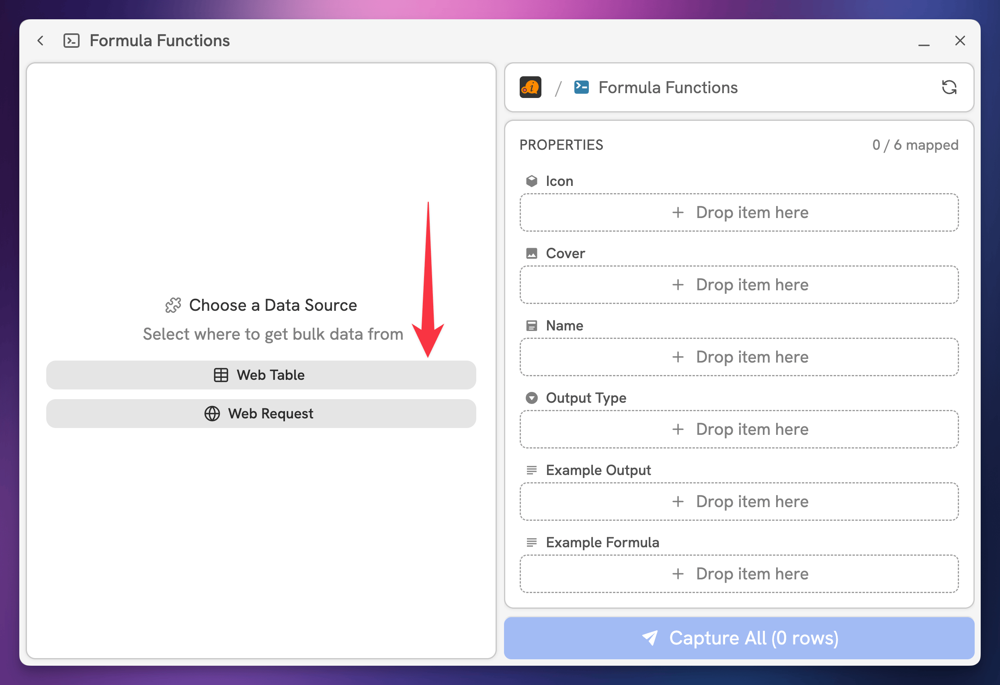

# Bulk Capture (Beta)

Bulk Capture is a feature that lets you create **multiple** pages in a Notion database – all at once – using:

* Rows from an HTML table
* Array elements from a web request's JSON response

If you've ever come across an HTML table on the web and thought,

> "Man, I wish I could turn this whole table into a Notion database!"

...then Bulk Capture is for you!


Bulk Capture is available on our Pro and Insider plans. Check out our [pricing page](https://flylighter.com/pricing/) to learn more and upgrade.


## Bulk Capture Example: HTML Tables

Here's a use case where Bulk Capture comes in handy. I've just come across a table of data on the web – in this case, [a table listing all of Notion's formula functions](https://thomasjfrank.com/formulas/functions/).

<figure><figcaption></figcaption></figure>

Now, I want to create a row in a Notion database for every row in the table. This is the end result I want:

\[Image here]

Of course, I could build this out manually by copying and pasting each row's data into a Notion database one-by-one.

Alternatively, I could just run a Bulk Capture Flow and create them in a few seconds. I'll take door #2, please!

To start, I'll create a new Flow and select **Bulk** as the type.

<figure><figcaption></figcaption></figure>

The Bulk Capture UI is a bit different than the UI for normal Flows. On the left, you'll see a column that will let you select either a Web Table or make a Web Request. We'll address these choices shortly.

Before that, you'll want to select a **Destination**. This works exactly like it does in normal Database Flows – you'll select a Notion data source, which is where new pages will be created when you run the Flow.

In this example, I've set up a data source called **Notion Capabilities,** making sure it's in a location shared with Flylighter.


If you don't initially see the data source you want to use, start typing to search for it. Flylighter pulls additional destinations from Notion as you type. If it still doesn't show up,  you likely need to [share it with Flylighter.](../troubleshooting/common-issues/no-destinations-found.md)


<figure><figcaption></figcaption></figure>

Once I've chosen my Notion data source (for the capture destination), I'll choose a Data Source for the bulk capture. In this case, I choose Web Table.

<figure><figcaption></figcaption></figure>

I then hit Select Table and click the table shown in the screenshot above, which contains all the data on those formula functions. Once I do, I see the UI shown below.

In the left column, I see a list of fields. Each field represents a **column** from the table, and shows a preview of its data. I can use the ← and → keys (first red arrow) to cycle through the rows, showing the data from that row.

Next, I drag these column fields to their matching properties in my Notion data source:

* Function → Name (Title)
* Data Output Type → Output Type (Select)
* Example → Example Formula (Text)
* Output → Example Output (Text)

<figure><figcaption></figcaption></figure>

Finally, I can hit **Capture All.** This will create a new page in my chosen Notion data source for _each_ row in the table. Each new page will have its properties filled in with the data from its matched row in the web table.


Bulk Capture is in beta, so you may run into bugs. If you do, please let us know in our [Discord community](https://discord.flylighter.com/)!

We're working on lots of improvements to this feature. Soon, you'll be able to map static values from the Data Picker that will be applied to every page in the bulk capture (e.g. applying a single emoji for the Page Icons), and you'll also be able to drag table values into the Content Editor as blocks in order to create page content.

