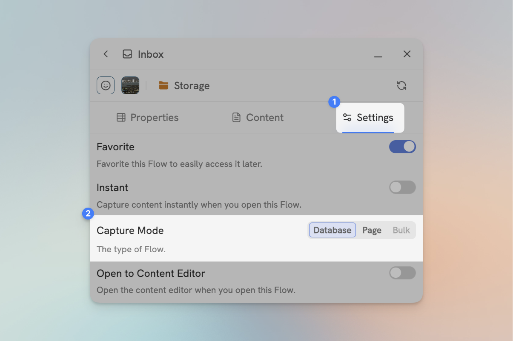
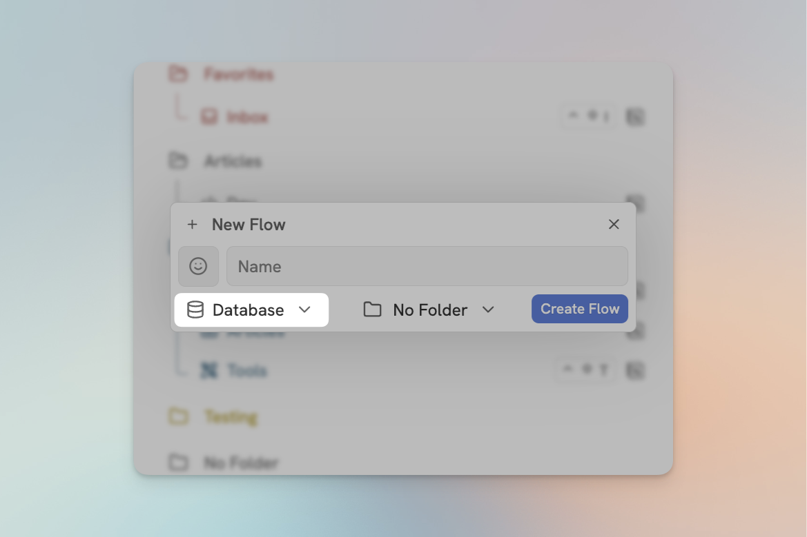
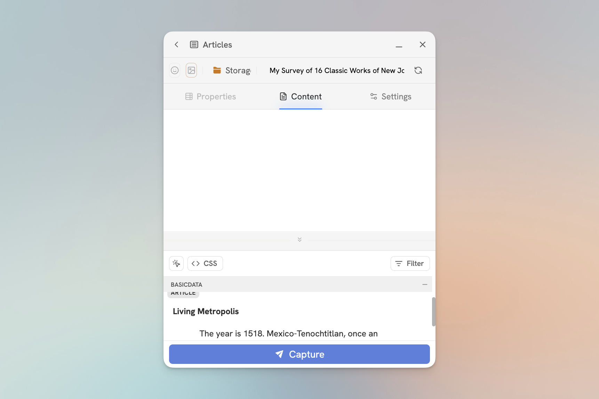

# Capture Modes

Flylighter currently has 2 capture modes available; Database Capture and Page Capture. You can change a Flows capture mode from Flow settings, or during Flow creation.

<figure><figcaption>
Setting the capture mode in Flow settings.
</figcaption></figure>
<figure><figcaption>
Setting the capture mode during Flow creation.
</figcaption></figure>

## Database Capture

Database capture is the default mode for Flows. Each capture is added as a new page in a database.

## Page Capture

Page capture allows you to capture to a specific page, and to Flow editor will only show the page content editor in this mode, more on the page content editor in the next article.. All captured data is appended to the end of the page.

When you switch a flow to page capture mode, you will be given the option of selecting an existing page in the selected database.

<figure><figcaption>
A Flow in page capture mode
</figcaption></figure>

## Append Capture

Append capture is similar to page capture, however you cannot change the destination.

## Bulk Capture

Coming soon!


