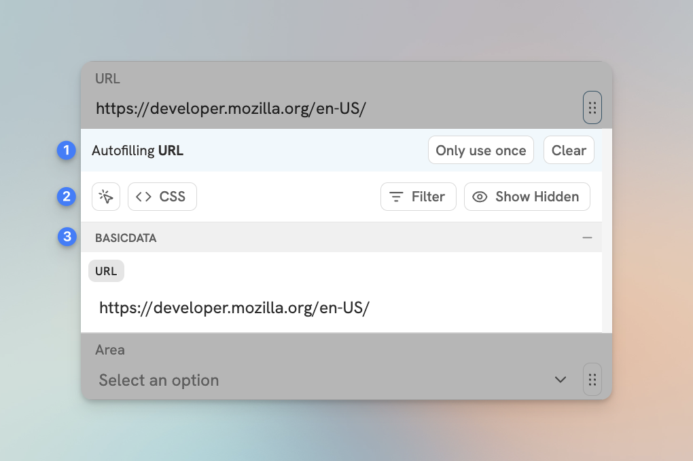

# Data Picker

The Data Picker is ubiquitous in the Flylighter UI. It can be found in the Flow Editor under each property, in the page icon and cover image, and in the Content Editor.

It is used to pick data from the page you are on, configure auto fill settings, and more.

## Using the Data Picker

The Data Picker can be daunting at first, but let's break it down by the contexts it is used in.

### Flow Properties

The Data Picker can be opened by clicking the **`⋮⋮`** button next to each property in the Flow Editor. In this context, there are three sections:

1. **Auto fill options** - This section shows a preview of the data from the currently set auto fill, as well as options related to the current state of the auto fill and property.
2. **Existing/new property options** - This section is the options row. In this context it will show the following options:
   1. **Element Picker** - This will open the Element Picker.
   2. **CSS** - Configure Custom CSS Selectors.
   3. **Filter** - Filter the data displayed based on the source of the data.
   4. **Show Hidden** - This will toggle the visibility of all data items (not just the suggested one).
3. **Text, numbers, checkbox states, dates** - This is where you can manually add data to the property.

<figure><figcaption>
The Data Picker in the Flow Editor.
</figcaption></figure>

### Page Icon and Cover Image

