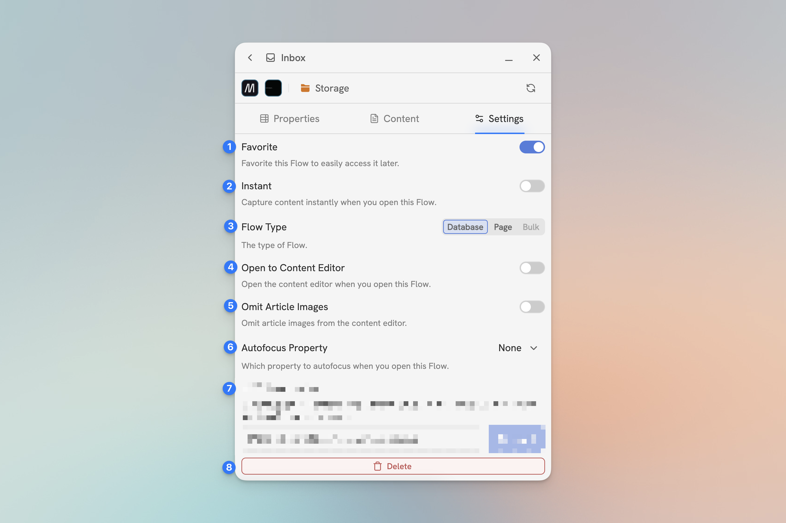

# Flow Settings

The Flow Settings Tab is where you can configure the Flow you are currently on. 

<figure><figcaption>
The Flow Settings Tab
</figcaption></figure>

1. **Favorite** - This will add the Flow to your list of favorites.
2. **Instant** - Toggle [Instant Capture](../getting-started/set-up-instant-capture.md) on and off. (Note: This will disable/override the **Open to Content Editor** setting.)
3. **Capture Mode** - Change the [Capture Mode](../in-depth/capture-modes.md)
4. **Open to Content Editor** - Enabling this settings will make the Flow open directly to the Content Editor.
5. **Omit Article Images** - Omits images from article captures.
6. **Autofocus Property** - Which property to focus on when the Flow is opened, if any. It can focus the first property, the first empty property, or note focus on any property.
7. **REDACTED** - 😉
8. **Delete** - Delete the Flow.
