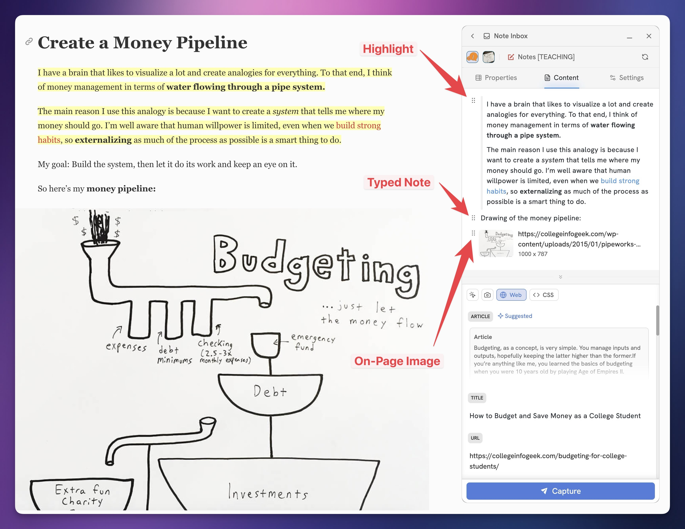

# Page Content Editor

Flylighter's **Content Editor** lets you capture nearly anything to the body of a Notion page. It gives you a **block editor** similar to the one you'll find in Notion itself.

Using the Content Editor, you can capture:

* Full articles
* Text highlights
* Special site data from sites like LinkedIn, X/Twitter, YouTube, and Reddit
* Images on the page
* Images from your clipboard or file system (dragged into the Content Editor)
* Screenshots
* Manually-typed notes
* YouTube notes with clickable timestamps
* HTML elements (e.g. tables)
* Site metadata from the Data Picker

You can access the Content Editor in any Flow by going to the **Content** tab.

<figure><figcaption></figcaption></figure>

With Flylighter open, you can fill up the Content Editor with any number of blocks, using the different methods listed above.

For example, on this article I've:

1. Captured a highlight (Select text → Right-Click → Capture Highlight)
2. Created a normal text block by typing
3. Captured the on-page image (Right-Click image → Capture Image)

<figure><figcaption></figcaption></figure>

### Capturing Full Articles

If you want to capture the full article on a page, you don't need to select the full text as a highlight.

Instead, find the **Article** data type in the Data Picker module beneath the Content Editor.

Click it, and you'll see Article come in as a block. Once you hit Capture, Flylighter will parse the entire article and capture it to Notion.


**Note:** You can still add additional blocks before or after the Article block!


<figure><figcaption></figcaption></figure>

### Autofill Content Editor Blocks

What if you want to **autofill** data in the Content Editor every time you run a Flow.

For instance, what if you always want to capture the Article of the page?

To do this, you can set any block you place in the Content Editor to **autofill.** To do this:

1. Click `⋮⋮` to the left of any existing block
2. Choose one of the autofill options

For dynamic data types from the Data Picker, such as the Article data type, you'll likely want to choose **Autofill Data Type.** This treats the block as a _variable._ In the case of Article, it'll dynamically parse and capture the article on the page.

<figure><figcaption></figcaption></figure>

For other use cases, you may want to choose **Autofill This Value.** This locks in the _specific value of the block right now._&#x20;

This is usually most useful for manually-typed text. For example, you might create a Flow that has some freewriting prompts in the Content Editor; these can be locked in using the Autofill This Value option.
