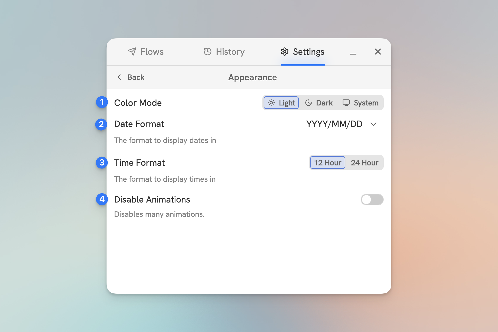

# Appearance

<figure><figcaption>
The Appearance Settings Tab
</figcaption></figure>

#### 1. **Color Mode**

Choose between Light and Dark mode.

#### 2. **Date Format**

Set your preferred date format.

#### 3. **Time Format**

Set your preferred time format.

#### 4. **Disable Animations**

Disable most animations for a more performant experience.
