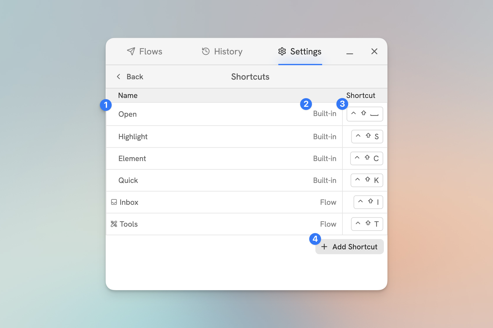

# Shortcuts

Keyboard shortcuts are a way to trigger actions or open Flows from your keyboard. All shortcuts are performed by holding the modifiers `Control+Shift` (Mac) or `Alt+Shift` (Windows). You can set any alphanumeric key as a shortcut.

<figure><figcaption>
The Shortcuts Settings Tab
</figcaption></figure>

#### 1. **The Shortcut Action or Flow**

The action or Flow that will be triggered when the shortcut is used.

#### 2. **The type of the Shortcut**

The type of the shortcut.

#### 3. **The Shortcut Key**

The key that will be used to trigger the shortcut.

### Adding a Shortcut

<figure><figcaption>
caption
</figcaption></figure>

Click the **+ Add Shortcut** button.

1. Select the action or Flow that will be triggered when the shortcut is used.
2. Select the key that will be used to trigger the shortcut.
3. Click **Save**.
