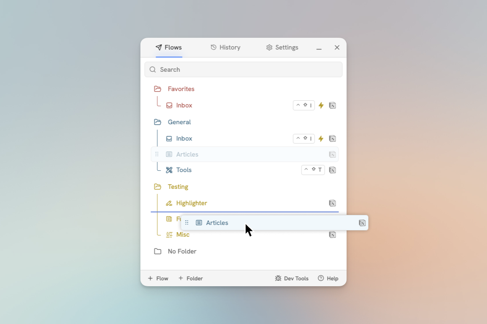

# Build a Thumbnail Collection

As someone who makes YouTube videos, I spend a lot of time trying to craft great thumbnails for my videos. In fact, [I even wrote a full guide on it](https://thomasjfrank.com/creator/youtube-thumbnail-design-the-ultimate-guide/).

I find that I create better outputs when I collect better inputs, and so over the last few years I've been building a collection of fantastic YouTube thumbnails from all sorts of different genres.

<figure><figcaption></figcaption></figure>

Here's how I collect thumbnail images quickly and efficiently with Flylighter.


New to Flylighter? Check out our guide on [how to create your first Flow](../getting-started/create-your-first-flow.md) for a more in-depth tutorial on everything you see below.


First, I've created a folder called **Swipes,** which houses Flows focused on "collections" of things. On of the Flows here is called **Thumbnails.**

<figure><figcaption></figcaption></figure>

This Flow is set to capture assets to my [Swipes database](https://thomasjfrank.com/docs/creators-companion/databases/swipes/), which is a dedicated database for visual inspiration that comes in [Creator's Companion](https://thomasjfrank.com/creators-companion/). Of course, you can choose any Notion database you like for this purpose – I'd just recommend giving it a Gallery view like the one in the first screenshot on this page.

In the **Cover** property, I've set the video's Thumbnail to autofill. I've also set a few other properties to autofill as well.

<figure><figcaption></figcaption></figure>

This ensures that the Page Cover and database properties are autofilled when I capture a new thumbnail. But what if you wanted the thumbnail directly on the page body – or what if you wanted to embed the video itself?

To do this, you can head to the Content tab of the Flow. In the Data Picker's **YouTube** plugin, you'll find both the Thumbnail and the Video as data items. Click whichever you like to add them as blocks in the Content Editor.

If you'd like to make sure these are always autofilled when you run the Flow, click the grip icon and check **Autofill Data Type.**

<figure><figcaption></figcaption></figure>

Here's a look at how quick it is to run the final Flow:

<figure><figcaption></figcaption></figure>
